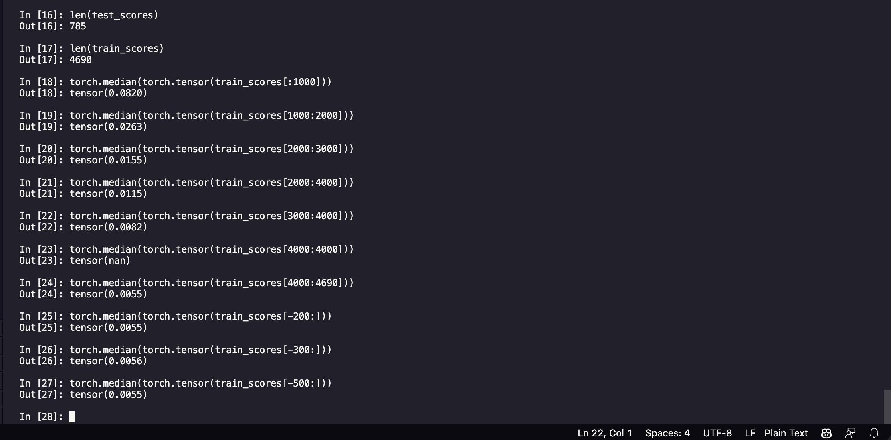

# Scaling Laws Framework

This repository serves as an opportunity for me to learn about how best to conduct scaling laws, using the classic MNIST dataset. The intention is to use this quick feedback loop environment to build a framework to be applied to more complex problems

1. Choose model and dataset
2. Ensure training algorithm converges
3. Enforce early stopping (rerun epochs until test loss gets worse given some patience)
4. Optimize over nuisance hyperparameters (ex. learning rate, dropout, etc.) ($\mu$Transfer might be helpful here)
5. Run models on all possible shapes using grid search bash script
6. Plot loss vs. each scientific hyperparameter
7. Extrapolate law

# Research
The model and training loop has been constructed, and nuisance hyperparameter values have been chosen.
- [x] Implement early stopping to extract maximum performance from each architecture
- [x] Run grid search. Learning rate shouldn't differ since the models don't vary much in scale (embed dim 10-20, depth 2-5 size yields between 100,000-300,000 parameters. 3e-4 seems to be optimal). As per the Scaling Laws paper, don't tune dropout beyond what's been shown to work well (0.1 dropout for each)
- [x] Plot embed dim and depth versus loss
- [x] Read the Greg Yang paper on scaling laws, might have some good insights about tuning the scaling laws framework above
- [ ] Gather more data points. Optimize nuisance hyperparameters (visualizing train vs test might be helpful for determining dropout)
  - [ ] Resolve irregularities / ensure correctness. Identify and resolve abnormalities in performance curves.
- [ ] Extrapolate law

### Getting more data points

Before the final step of extrapolating the functional forms, we need to collect more data points. This involves simply adjusting the width and depth. Unfortunately, each varying size brings its own fair share of challenges. Increased capacity results in new optima for regularization, more complex optimization landscapes results in new optima for learning rates, etc. That's to say, **we need better methods for tuning nuisance hyperparameters to milk peformance at every shape.** If we can do this, we'll know that the data points collected are grounded in truth.

Does this mean that the model has reached its lowest possible train loss?

## Insights thus far
- Batch size seems to perform better at 64
- Dropout should be tuned very carefully. 0.15 > 0.1 > 0.2
- Smaller batches benefit from smaller learning rates