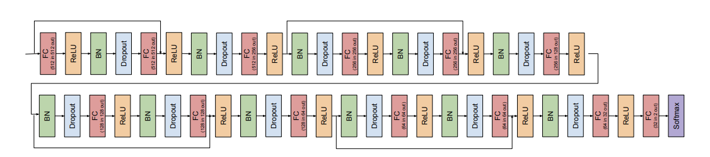

# Scaling Laws Framework

This repository serves as an opportunity for me to learn about how best to conduct scaling laws, using the classic MNIST dataset. The intention is to use this quick feedback loop environment to build a framework to be applied to more complex problems. 

Scaling laws fundamentally consists of changing the depth and width of a model, plotting its test loss, and then observing a functional form relating the variables. The primary goal should be optimizing the accuracy of your law's predictive performance. Consider various [[Scaling strategies]] (ex. scaling width exclusively, depth exclusively, combination of both, etc.). Explore good nuisance HPs values for certain regimes by exploring changes in performance across several HP values. It's also worth noting whether the values that work for one regime translate well into others. Eventually, you figure out what's the right way to scale it up such that it performs best.

# Todo
## 2023/05/15

*Width monotically decreases loss as anticipated, but depth strangely results in an increase in loss. Find the source and eliminate the problem.*

Training loss appears to be considerably smaller than validation loss. The most obvious cause of counterintuitive loss as depth increases is overfitting. Mess around with the model's regularization to see if solves the problem.

- [x] Observe effect of increasing regularization

Strangely enough, the delta between train and validation barely changed. Furthermore, both loss scores increased noticeably, so dropout ought not to change.

The next logical explanation is a limitation in my architecture. A simple MLP is not designed to scale, so perhaps adding batch normalization and residual blocks will permit for more layers? 

- [x] Modify architecture to better accomodate very deep training (ex. use residual MLP $h = h_{\text{prev}} + \text{relu}(Wh_{\text{prev}} + b)$)

  - [x] Batch Norm
  - [x] Architecture

    - The basic block here seems to be FC -> ReLU -> BN -> Dropout
    - The first skip connection sources at the input tensor and skips to just after the second FC layer
    - The second skip connection sources at the third block's ReLU layer and skips to just after the fifth's FC layer
    - The third skip connection sources at the sixth block's ReLU layer and skips to just after the eighth's FC layer
    - The fourth skip connection sources at the ninth block's ReLU layer and skips to just after the eleventh's FC layer
    - Downsampling block at the end seems to be FC -> ReLU -> FC -> Softmax

  - [x] Skip connections
  

Currently assessing performance. The loss curve is far less dramatic as width is scaled, but I'm assuming that will be at the added benefit that the monotonic trend will last longer. Oddly enough, depth may be still getting worse? Try on varying depths at a decent width (i.e 64) to confirm.

- [x] Observe ResMLP depth scaling regime

Across all widths, loss gets almost linearly worse as depth increases. We've already covered training configuration and model architecture, so why else could it be behaving this way?

## 2023/05/22

A standard model that's known to scale well should be used, on a dataset of appropriate difficulty. [[ResNet on CIFAR10]] is chosen for its combination of speed and expressivity. This will rule out whether depth is failing for an architectural reason, or something more elusive such as the absence of a learning rate scheduler.

- [x] Implement ResNet on CIFAR10

Depth appears to be working now, fortunately. That being said, there are two questions that remain:

1. ResNet is so effective that smaller sizes take exceedingly long on the test loss patience early stopping paradigm. Should this be changed? If so, how?
2. The ResNet architecture scales width by 2x for every increase by one block in depth. This is because the feature map size is halved, so the number of filters is doubled to preserve the time complexity per layer. Does this mean my width vs. depth scaling strategies are fair comparisons?