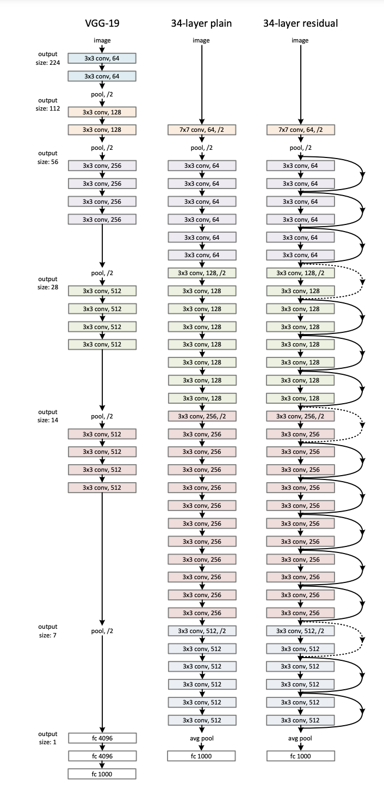

# ResNet on CIFAR10

The plain/residual architectures follow the form in Fig. 3 (middle/right). The network inputs are 32×32 images, with the per-pixel mean subtracted. The first layer is 3×3 convolutions. Then we use a stack of 6n layers with 3×3 convolutions on the feature maps of sizes {32, 16, 8} respectively, with 2n layers for each feature map size. The numbers of filters are {16, 32, 64} respectively. The subsampling is performed by convolutions with a stride of 2. The network ends with a global average pooling, a 10-way fully-connected layer, and softmax. There are totally 6n+2 stacked weighted layers. The following table summarizes the architecture

| output map size | 32x32 | 16x16 | 8x8 |
| --------------- | ----- | ----- | --- |
| # layers        | 1+2n  | 2n    | 2n  |
| # filters       | 16    | 32    | 64  |

## What are the practical hyperparameter choices based on this information?

- `num_residuals` should be 2
- `num_channels` should double each block
- `kernel_size` should be 3 for `b1`

## TODO
- [x] Build architecture
- [x] Select correct fixed hyperparameters
- [x] Train on varying depths, observe changes in performance
  - [ ] If nothing improves, adopt ResNet training procedure (optimizer, lr scheduler, etc.)

**DEPTH IS WORKING**