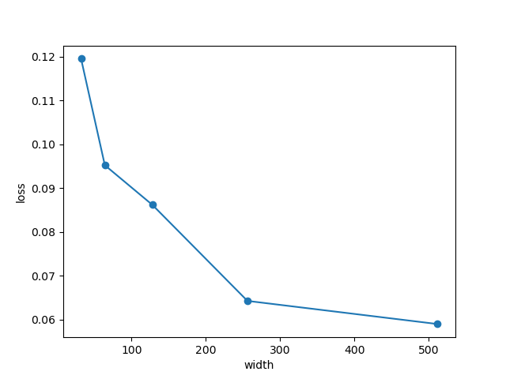

# Scaling strategies

Each scaling law should yield a functional form informing us how performance measures against the strategy. By doing this across multiple different strategies, we can figure out the most optimal way to scale the model up such that it performs best.

### Strategies to explore
- Model size
- Shape (depth, width, ratio)
- Batch size

## Model size
## Shape

## Batch size