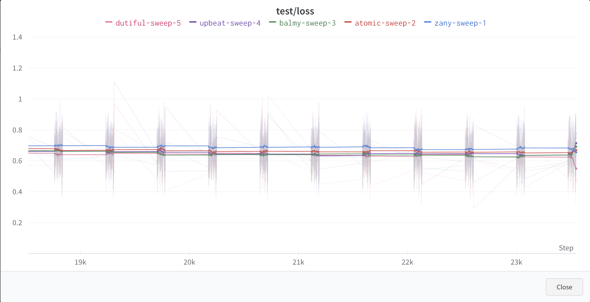
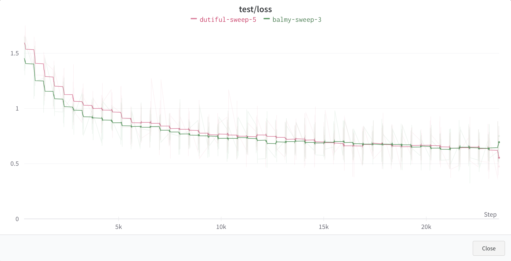
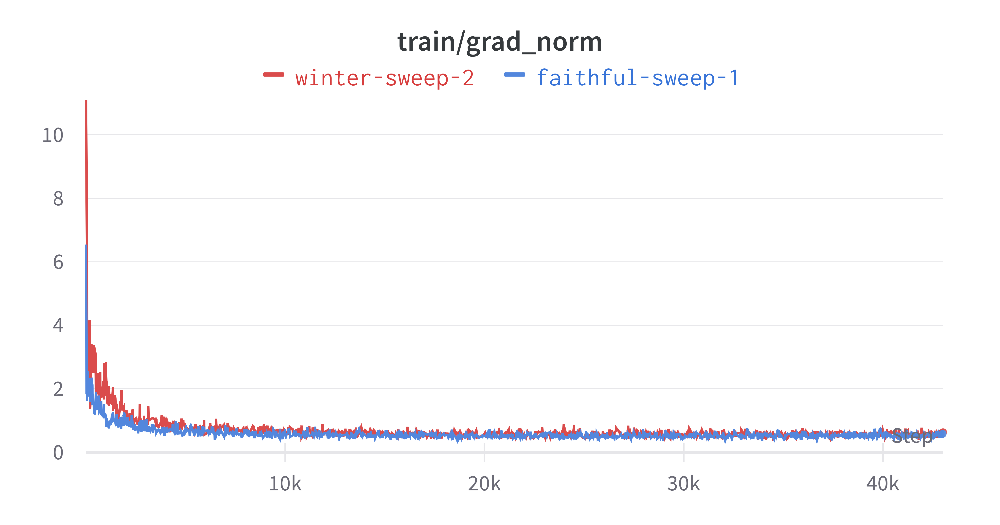
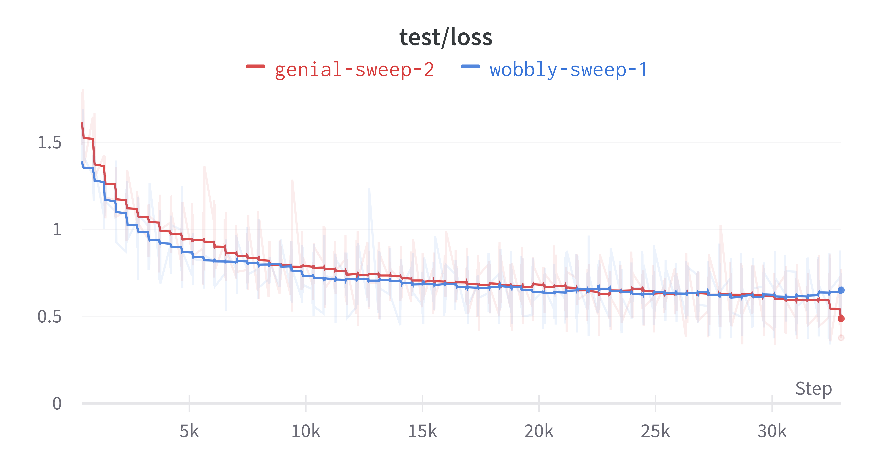
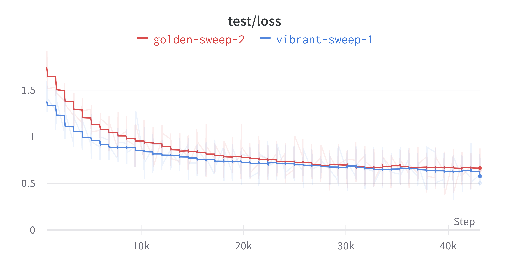
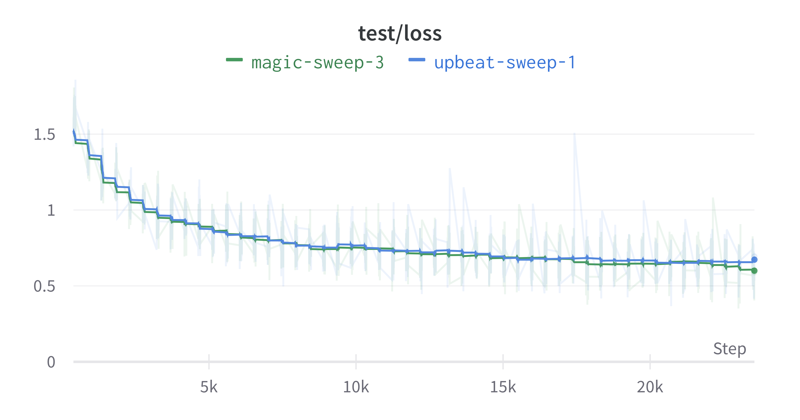

# Achieve stability

As of now, a training regime has been finalized. Learning rate and weight decay sweeps have been conducted, setting a good baseline for future scaling strategies.

However, upon observing the depth scaling strategy, results are ambiguous. There's no clear best model, and worse yet, performance does not follow any clear trend (the expectation being a monotonic increase in performance as depth is scaled). 

This is a massive issue because the core feature of scaling laws research rests on the predictive power of the constructed functional form. If every epoch regime yields a different functional form (even regimes within 1 epoch of another), the predictive power is essentially zero. We're looking for <ins>stable</ins> learning curves with clear monotonic performance trends. Larger models should be consistently more performant than smaller ones, and the observed forms shouldn't change much for epoch regimes within reasonable bounds.

## Diagnosis

>Start out with the tiniest provable experiment when debugging. Incrementally add complexity.

What observations can be made of the faulty learning curves?

- Depth 9 starts out much worse than depth 5
- Depth 9 crosses depth 5 at the 15k'th step
- Depth 9 flatlines after the intersection point.

What factors could lead to this flatlining behaviour?

- Insufficient number of epochs for depths to diverge
- Vanishing gradients
- Insufficient quantity of data
- Local minimum approximation
  

Aside from a turbulent beginning, there doens't seem to be any exploding (and much less) vanishing gradients.

There doesn't appear to be any noticeable difference in performance across varying epochs. The flatline effect is very real.

- [x] Make sure image normalization is good
- [x] Make sure parameter initialization is good
- [x] Observe difference that clip grad norm makes

There doesn't appear to be any change in performance. The losss gap between depths 5 and 9 during the first epoch was in fact more pronounced, but the two changes (image normalization, gradient clipping) seem to be generally applicable enough that it's probably worth keeping.

Another possibility is that it's just trapped in a local minimum. This is unlikely, but still worth a shot to try out. We can set an experiment up to determine this pretty easily by just changing the seed (and optionally the learning rate as well).

This actually turned out to be quite fruitful. The terrible first test loss from this model seems to have disappeared, and depth 9 is consistently better than depth 5 (albeit to a marginal extent). Now, it's worth determining if this is true as we scale up. Rerun the depth scaling experiment using this configuration, but with more spaced out values.

## Solution